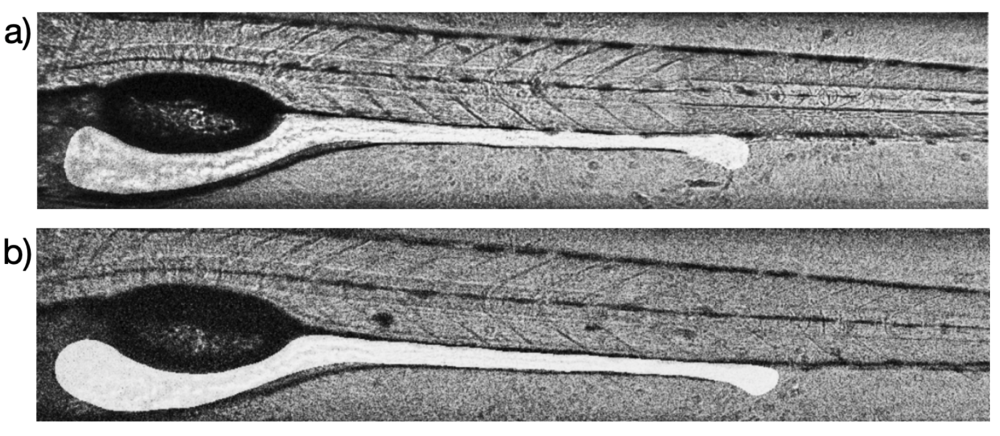

# Zebrafish-Image-Segmentation-ML

[](https://www.tensorflow.org/)
[](https://www.python.org/)
[](LICENSE)

## 📋 Overview

This library uses UNet to segment the gut of the zebrafish from the Bright Field images obtained using the Parthasarathy lab's LSFM. The model eliminates the need for time-consuming manual annotation of gut boundaries, significantly accelerating the research pipeline for studying gut microbiota dynamics and host-microbe interactions.

**Authors:** Piyush Amitabh, Susana Márquez  
**Institution:** University of Oregon, Parthasarathy Lab  
**Year:** 2022

## 🔬 Background

### Why Zebrafish?

<p align="center">
  
</p>

**Figure 1.** (a) Larval zebrafish at 5dpf; the intestine is highlighted by phenol red dye via microgavage [2]. Scale bar: 500 µm. [7] (b) Maximum intensity projection (MIP) of Vibrio in the larval intestine. Scale bar: 100 µm. [7] (c) MIP showing immune Cells in zebrafish larva: Neutrophils (green), Macrophages (red).

Zebrafish (*Danio rerio*) are an invaluable model organism for biomedical research:
- Share ~70% of their genome with humans
- Completely transparent larvae enabling direct observation
- Low-cost maintenance with rapid generation times
- Widely used for studying metabolic diseases and host-microbe interactions

### The Challenge
Traditional image analysis in the Parthasarathy lab requires:
- Manual stitching of multiple images from LSFM
- Hand-drawing gut masks for each image
- Significant time investment from researchers

**Our Solution:** Automated gut segmentation using deep learning with UNet architecture

## 🏗️ Architecture

### UNet Model

<p align="center">
  
</p>

**Figure 2.** U-net architecture (example for 32x32 pixels in the lowest resolution). Each blue box corresponds to a multi-channel feature map. The number of channels is denoted on top of the box. The x-y-size is provided at the lower left edge of the box. White boxes represent copied feature maps. The arrows denote the different operations. [4]

The implementation uses the UNet architecture, which has proven highly successful for biomedical image segmentation tasks:

**Key Features:**
- Encoder: 5 blocks with 2 convolutions + max pooling
- Decoder: Transposed convolutions with skip connections
- Binary Cross-Entropy loss function
- Adam optimizer with default learning rate

### Model Specifications
- **Input Size:** 256x1024 (resized from original 2048x6000)
- **Batch Size:** 8
- **Epochs:** 32 with early stopping (patience=10)
- **Framework:** TensorFlow with Keras API

## 📊 Dataset

### Data Collection Process

<p align="center">
  
</p>

**Figure 3.** (a) Three consecutive Bright field microscopy images covering the entire Zebrafish gut on 4dpf (days post fertilization) at 20x objective magnification. We image the entire gut on our custom built LSFM setup at the median sagittal plane of the fish. (Each image size is 2048x2048). (b) Shows the stitched image showing the entire gut (image size is 2048x6000). (c) Binary Masks showing the gut of the zebrafish. The BF images shown in (b) at the median sagittal plane of the fish are used to draw gut masks manually using a Wacom Cintiq® graphics tablet.

### Data Specifications
- **Microscope:** Custom-built Light Sheet Fluorescence Microscope (LSFM) - Parthasarathy Lab
- **Original Dataset:** 72 images → 24 stitched bright-field images
- **Image Dimensions:** 
  - Original: 2048x2048 per image (3 images per gut)
  - Stitched: 2048x6000
  - Model Input: 256x1024 (resized)

### Data Augmentation

<p align="center">
  
</p>

**Figure 4.** (a) Original image without any transformation. (b) Same image after applying random brightness, contrast and Gaussian noise with µ = 0, σ = 0.0125.

To address the limited dataset size, we applied realistic augmentations:
- Random contrast adjustment (bounds: 0.2-0.5)
- Random brightness variation (δ = 0.3)
- Gaussian noise (μ=0, σ=0.01-0.0125)

**Result:** Expanded dataset from 24 to 624 training images

## 📈 Results

### Model Performance

<p align="center">
  
</p>

**Figure 5.** Train (blue) and test (orange) model accuracy. A tiny gap of 0.02 is evident between the two curves showing a slight overfit.

- **Training Accuracy:** ~98%
- **Test Accuracy:** ~96%
- Slight overfitting observed (0.02 gap between train/test accuracy)
- Early stopping triggered at epoch 16 (patience=10)

### Segmentation Examples

#### ✅ Successful Predictions

<p align="center">
  
</p>

**Figure 6.** Four examples of successful prediction of the gut, where almost all the anterior part and the whole posterior side of the gut is identified and segmented.

The model successfully:
- Identifies complete anterior gut regions
- Segments entire posterior gut sections
- Maintains gut continuity
- Produces smooth, organic boundaries

#### ⚠️ Current Limitations

<p align="center">
  
</p>

**Figure 8.** Four examples of failed prediction of the gut. In the first two, the posterior part has completely failed to be segmented while for the last two, the anterior side shows discontinuities.

Common failure modes:
- Posterior gut segmentation failures
- Discontinuities in anterior regions
- Sharp corners in predictions
- Brightness-related exclusions

## 🚀 Getting Started

### Prerequisites
```bash
pip install tensorflow>=2.0
pip install numpy
pip install opencv-python
pip install matplotlib
pip install scikit-image
pip install jupyter
```

### Installation
```bash
git clone https://github.com/pamitabh/Zebrafish-Image-Segmentation-ML.git
cd Zebrafish-Image-Segmentation-ML
pip install -r requirements.txt
```

### Repository Structure
```
Zebrafish-Image-Segmentation-ML/
├── UNet_training.ipynb   # Main Jupyter notebook with model implementation
├── data/                  # Dataset directory (not included in repo)
│   ├── raw/              # Original microscopy images
│   ├── processed/        # Stitched and resized images
│   └── masks/            # Binary segmentation masks
├── models/               # Saved model weights
├── images/               # Figures for documentation
└── README.md            # This file
```

### Usage

#### Training the Model

Open the Jupyter notebook to train the model:
```bash
jupyter notebook UNet_training.ipynb
```

Or use the following Python code:

```python
import tensorflow as tf
from tensorflow.keras import layers, models
from tensorflow.keras.callbacks import EarlyStopping

# Define UNet architecture
def create_unet(input_shape=(256, 1024, 1)):
    inputs = layers.Input(input_shape)
    
    # Encoder path (contraction)
    c1 = layers.Conv2D(64, (3, 3), activation='relu', padding='same')(inputs)
    c1 = layers.Conv2D(64, (3, 3), activation='relu', padding='same')(c1)
    p1 = layers.MaxPooling2D((2, 2))(c1)
    
    # ... (additional layers as shown in notebook)
    
    # Decoder path (expansion)
    # ... (transposed convolutions with skip connections)
    
    outputs = layers.Conv2D(1, (1, 1), activation='sigmoid')(c9)
    
    model = models.Model(inputs=[inputs], outputs=[outputs])
    return model

# Compile and train
model = create_unet()
model.compile(optimizer='adam', 
              loss='binary_crossentropy', 
              metrics=['accuracy'])

# Setup early stopping
early_stopping = EarlyStopping(monitor='val_loss', 
                               patience=10, 
                               restore_best_weights=True)

# Train model (assuming data is loaded)
history = model.fit(X_train, y_train,
                    batch_size=8,
                    epochs=32,
                    validation_data=(X_test, y_test),
                    callbacks=[early_stopping])
```

#### Making Predictions
```python
import numpy as np
from tensorflow.keras.models import load_model
import cv2

# Load trained model
model = load_model('models/zebrafish_gut_unet.h5')

# Load and preprocess new image
image = cv2.imread('path/to/new_image.tif', cv2.IMREAD_GRAYSCALE)
image_resized = cv2.resize(image, (1024, 256))
image_normalized = image_resized / 255.0
image_input = np.expand_dims(np.expand_dims(image_normalized, axis=-1), axis=0)

# Predict
prediction = model.predict(image_input)
binary_mask = (prediction[0, :, :, 0] > 0.5).astype(np.uint8) * 255

# Save result
cv2.imwrite('path/to/output_mask.png', binary_mask)
```

## 🔮 Future Work

1. **Sub-region Segmentation**: Extend model to segment specific gut regions (anterior, middle, posterior)
2. **Multi-scale Support**: Train for different magnifications (4x, 40x) for microscope-agnostic performance
3. **Topological Constraints**: Implement shape priors to ensure organic, continuous predictions without discontinuities
4. **Enhanced Augmentation**: 
   - Elastic deformations to simulate peristaltic motion
   - Local brightness variations
5. **Cross-microscope Compatibility**: Make model work across different LSFM setups

## 🤝 Contributing

We welcome contributions! Areas for improvement include:
- Implementing additional augmentation techniques
- Optimizing model architecture
- Extending to other microscopy modalities
- Improving segmentation accuracy in failure cases
- Creating GUI for easier usage

Please feel free to open issues or submit pull requests.

## 📝 Citation

If you use this work in your research, please acknowledge the use of this repo. Thanks!

## 📚 References

[1] Piyush Amitabh and Susana Márquez. Zebrafish-Image-Segmentation-ML, 2022. https://github.com/pamitabh/Zebrafish-Image-Segmentation-ML

[2] Cocchiaro, J. L., & Rawls, J. F. (2013). Microgavage of zebrafish larvae. *JoVE (Journal of Visualized Experiments)*, (72), e4434.

[3] Müller, B., & Grossniklaus, U. (2010). Model organisms—a historical perspective. *Journal of proteomics*, 73(11), 2054-2063.

[4] Ronneberger, O., Fischer, P., & Brox, T. (2015). U-net: Convolutional networks for biomedical image segmentation. *International Conference on Medical image computing and computer-assisted intervention*, 234-241.

[5] Siddique, N., et al. (2021). U-net and its variants for medical image segmentation: A review of theory and applications. *IEEE Access*.

[6] Teame, T., et al. (2019). The use of zebrafish (Danio rerio) as biomedical models. *Animal Frontiers*, 9(3), 68-77.

[7] Wiles, T. J., et al. (2016). Host gut motility promotes competitive exclusion within a model intestinal microbiota. *PLoS biology*, 14(7), e1002517.

## 📄 License

This project is licensed under the MIT License - see the [LICENSE](LICENSE) file for details.

## 👥 Contact

- **Piyush Amitabh** - pamitabh@uoregon.edu
- **Susana Márquez** - susanam@uoregon.edu

**Parthasarathy Lab**  
University of Oregon  
1585 E 13th Ave, Eugene, OR 97403

## Acknowledgments

- Parthasarathy Lab
- G3CF, Imaging Core facility, University of Oregon for microscopy support
- Aquatic Animal Care Services, University of Oregon
- TensorFlow/Keras development team

---

<p align="center">
  <i>Advancing biomedical research through automated image analysis at the Parthasarathy Lab</i>
</p>
